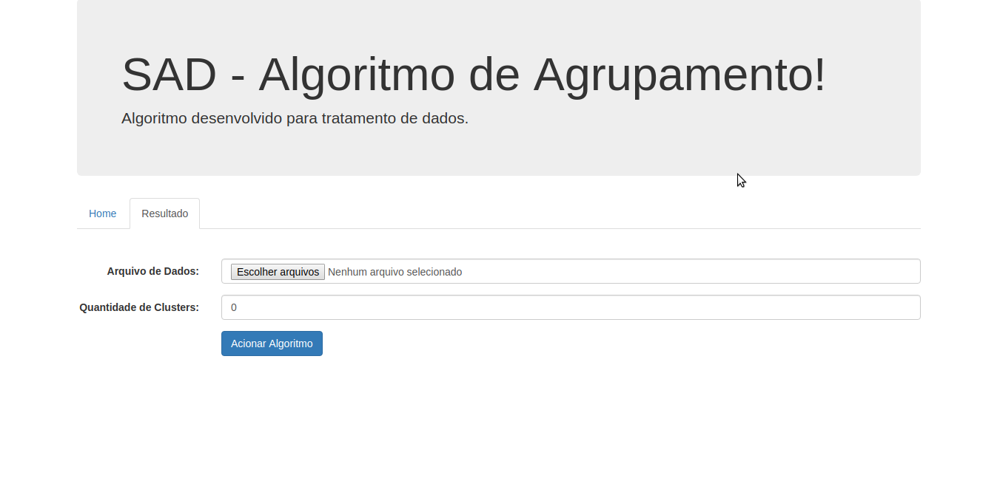
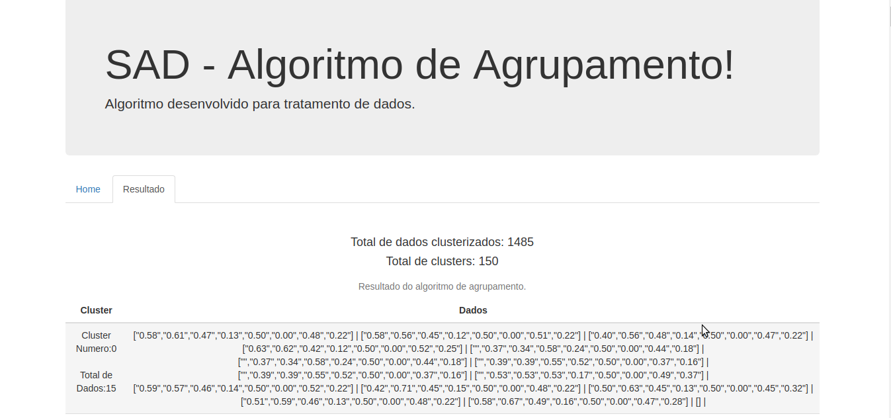

## Algoritimo de agrupamento de dados

O algotimo pode não funcionar para qualquer tipo de dados, logo abaixo estará uma breve descrição de como utilizar o software e quais dados foram utilizados no trabalho. O algoritimo falta alguns refinamentos como alguns dos listados abaixo:

- Os centroids não são inteligentes, são gerados de forma aleatória e não de acordo com o maior agrupamento de dados mais perto; 

- Para montar os clusters é utilizado a distância euclidiana, dependendo da forma que o algoritimo de corporta os clusters podem não ser formados pela mesma quantidade de dados caso o mesmo for executado 2 vezes;

- Os dados são diponibilidados em uma tabela pelo fato de não conseguir achar disponível um gráfico que trabalhe com mais de 3 dimenções;

#### Modo de usar

1. Baixe o projeto e o descompact;
2. Entre dentro da pasta que foi descompactada e abra o arquivo <strong>index.html</strong> no navegador;
3. Na tela inicial selecione o arquivo <strong>yeast.data</strong>, e coloque o numero de clusters que deseja criar, o link do arquivo esta disponível logo abaixo:
    - Link do yeast.data: https://archive.ics.uci.edu/ml/machine-learning-databases/yeast/yeast.data
    - Veja a tela inicial do software logo abaixo onde é possível ver os capos para selecionar o arquivo e digitar o numero de cluster

4. Logo depois é só clicar no botão <strong>Acionar Algoritmo</strong>, nesse passo o arquivo será preparado e o algoritmo irá rodas.

5. Logo depois bas clicar no link resultado onde será possível ver várias informações, inclusive os dados agrupado de acorodo com o cluster ao que foi designado, veja a tela de resultados logo abaixo:

#### Mais informações

Ainda faltam algumas melhorias que devem ser feitas no algoritmo, e o algoritimo principal está totalmente desvinculado das outros funcionalidade que estão disponíveis no software. O arquivo principal está disponível no seguinte caminho:

- Caminho do arquivo principal do algoritmo dentro da pasta do projeto é: <strong>./js/kMeans.js</strong> 
